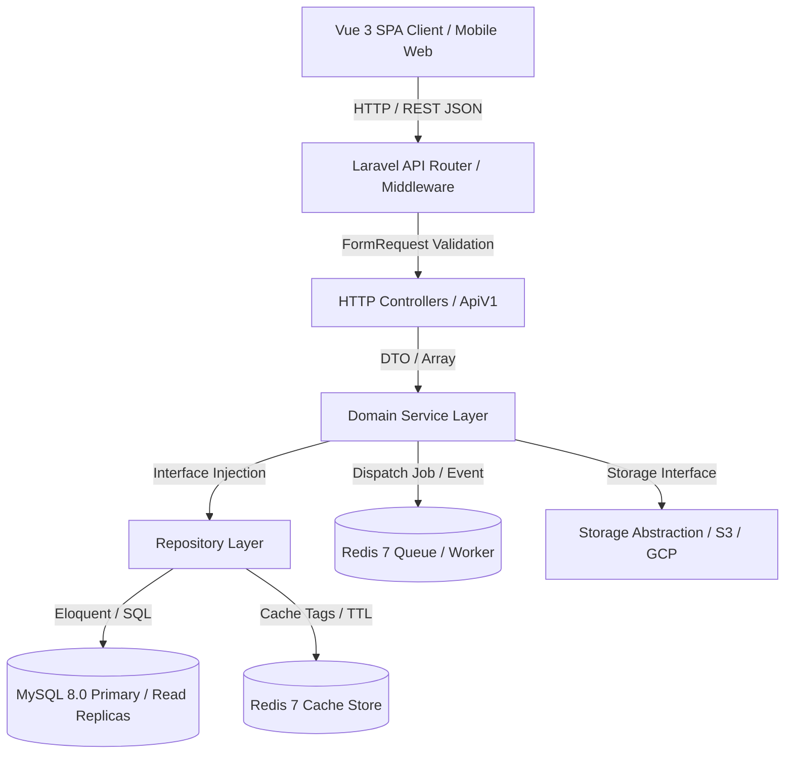

# SunTrack — Enterprise Architecture Blueprint & Technical Specification

This document provides a comprehensive architectural breakdown of the SunTrack Enterprise Promotion & Campaign Management System. It serves as the primary reference for software engineers, systems architects, and DevOps engineers maintaining and scaling the platform.

---

## 1. Architectural Philosophy & Core Principles

SunTrack is engineered around five fundamental software architecture principles:

1.  **Clean Architecture & Strict Separation of Concerns:** Business logic is decoupled from HTTP transport layers, database frameworks, and external third-party APIs.
2.  **SOLID Object-Oriented Design:** All components follow Single Responsibility, Open-Closed, Liskov Substitution, Interface Segregation, and Dependency Inversion principles.
3.  **Docker-First & Zero Host Dependency (ADR-018):** All development, testing, and production runtime environments execute inside isolated containers via Docker Compose. No host installation of PHP, Node.js, Composer, or web servers is required.
4.  **Immutable Audit Trails & Observability:** Every state transition, financial pricing adjustment, and brand collaboration interaction is recorded immutably in `approval_histories` and centralized via `ActivityLogger`.
5.  **Zero Breaking Changes & Backward Compatibility:** API endpoints enforce versioning (`/api/v1/`) and additive schema design to guarantee seamless client integrations.

---

## 2. Layered Architecture Breakdown

SunTrack enforces a strict multi-tiered architectural hierarchy:

### 1. Presentation Layer (Vue 3 Single Page Application)
- **Technology:** Vue 3 (Composition API), Vue Router, Pinia State Management, Vite asset bundler.
- **Responsibility:** Renders dynamic operational workspaces (Admin Command Center, Public Brand Review Portal). Employs reusable UI components (`ModalForm`, `DataTable`, `EmptyState`) with responsive design and glassmorphism styling.

### 2. HTTP Controller & Validation Layer (`app/Http/Controllers/Api/V1/`, `app/Http/Requests/`)
- **Responsibility:** Handles HTTP request reception, authentication/authorization validation, and response serialization.
- **Validation:** All incoming data MUST pass through dedicated Form Requests (`StoreCampaignRequest`, `UpdatePromotionRequest`, `PromotionVariantRequest`) enforcing domain rules (e.g., floor price margin protection).
- **Serialization:** Returns standardized JSON payloads via the `ApiResponse` trait and Resource classes (`CampaignResource`, `PromotionResource`, `DashboardResource`). Controllers MUST contain zero direct SQL or complex business calculation loops.

### 3. Domain Service Layer (`app/Services/`)
- **Responsibility:** Encapsulates complex business workflows, multi-entity transactions, and third-party integrations.
- **Core Services:**
  - `SettingsService`: Manages dynamic system configurations with forever-caching in Redis.
  - `StorageService`: Implements `StorageDriverInterface` to manage multi-cloud media storage (`LocalDriver`, `S3Driver`, `GoogleDriveDriver`).
  - `ReportingService`: Manages export adapters (`ExcelExporter`, `PdfExporter`, `CsvExporter`) via the Adapter pattern.
  - `NotificationService`: Manages delivery drivers (`WhatsAppDriver`, `EmailDriver`) with graceful fallback to Log Mode.
  - `ActivityLogger`: Centralized static logging service generating polymorphic audit entries.

### 4. Repository & Data Access Layer (`app/Repositories/`, `app/Contracts/Repositories/`)
- **Responsibility:** Abstracting data persistence and Eloquent ORM operations.
- **Design:** All data access goes through domain repositories (`CampaignRepository`, `PromotionRepository`, `ProductRepository`, `DashboardRepository`) implementing `RepositoryInterface`. Repositories handle eager loading (`with()`), query pagination, and Redis caching strategies, eliminating N+1 query bottlenecks.

---

## 3. Containerized Micro-Service Topology

The system is deployed as an orchestrated stack of 6 specialized Docker micro-services:
1.  **`app` (`suntrack-app`)**: Multi-stage PHP 8.2-FPM & Node.js 20 runtime executing business logic and asset compilation.
2.  **`nginx` (`suntrack-nginx`)**: Alpine web server acting as reverse proxy and static asset delivery engine.
3.  **`mysql` (`suntrack-mysql`)**: MySQL 8.0 relational database engine with volume persistence (`mysql_data`).
4.  **`redis` (`suntrack-redis`)**: Redis 7 Alpine engine powering `CACHE_STORE`, `QUEUE_CONNECTION`, and `SESSION_DRIVER` (`redis_data`).
5.  **`queue-worker` (`suntrack-queue-worker`)**: Asynchronous worker processing background job queues (`php artisan queue:work`).
6.  **`scheduler` (`suntrack-scheduler`)**: Automated scheduler evaluating console cron rules every minute (`php artisan schedule:work`).

---

## 4. Scalability & High-Throughput Design

To maintain sub-100ms API response times under enterprise data loads (±100,000 records), SunTrack employs three scalability pillars:
1.  **Redis Caching Strategies & Observers:** High-read endpoints (Dashboard analytics, catalog listings, system settings) are cached in Redis using tag-based or key-based caching. Laravel Observers (`CampaignObserver`, `PromotionObserver`, etc.) listen for model mutation events (`saved`, `deleted`) and automatically invalidate stale cache keys.
2.  **Database Indexing & Read Replica Separation:** Composite database indexes are maintained on high-cardinality foreign keys and status columns. `config/database.php` is configured with separate `read` and `write` MySQL host arrays with `'sticky' => true` to support horizontal read replica scaling without read-after-write latency anomalies.
3.  **Stateless Container Scaling:** Because sessions and caches reside entirely in Redis and media uploads reside in multi-cloud storage (S3/GCP), the `app` and `nginx` container tier is 100% stateless and can be scaled horizontally behind an enterprise load balancer (AWS ALB, Nginx Load Balancer, or Kubernetes Ingress).

---

## 5. Observability & Monitoring Foundations (ADR-021)

To ensure enterprise-grade reliability and rapid root-cause analysis during staging and production operations, SunTrack establishes foundational architecture for comprehensive observability:

1.  **Laravel Telescope (Development Only):**
    - **Purpose:** Provides granular real-time debugging for SQL queries, exception stack traces, cache hits/misses, and queued job executions during local development.
    - **Governance:** Configured strictly in `require-dev` and disabled in production environments (`TELESCOPE_ENABLED=false` in production `.env`) to prevent memory overhead and database log bloating.
2.  **Laravel Pulse (Production Performance Monitoring):**
    - **Purpose:** Serves as the lightweight, real-time server performance monitoring dashboard for production. Tracks server CPU/memory usage, slow endpoints, slow jobs, and user request frequencies.
    - **Governance:** Secured via RBAC permissions (`viewPulse`), accessible only to users with the `Super Admin` or `Operational Staff` roles.
3.  **Slow Query Logging & Execution Plan Profiling:**
    - **Purpose:** Identifies database bottlenecks before they impact end-users.
    - **Implementation:** In `AppServiceProvider`, a database query listener (`DB::listen`) is registered when `APP_DEBUG=false` or `SLOW_QUERY_LOGGING=true`. Queries exceeding **100ms** execution time are recorded via Laravel's `Log::warning()` and `ActivityLogger` with SQL bindings and stack traces.
4.  **Log Rotation & Retention (`config/logging.php`):**
    - **Purpose:** Prevents server disk exhaustion from log accumulation.
    - **Configuration:** Uses the `daily` log channel driver with a configured `max_files: 30` retention window, automatically rotating `laravel-YYYY-MM-DD.log` archives.
5.  **Redis & Queue Monitoring:**
    - **Purpose:** Ensures high-throughput background automation without job deadlocks or memory leaks.
    - **Architecture:** Health Check endpoints (`GET /api/v1/health`) actively evaluate Redis ping responses. Background queues (`suntrack-queue-worker`) are monitored for failed jobs (`failed_jobs` table and `php artisan queue:failed`), with automated retry mechanisms configured via `php artisan queue:retry`.

