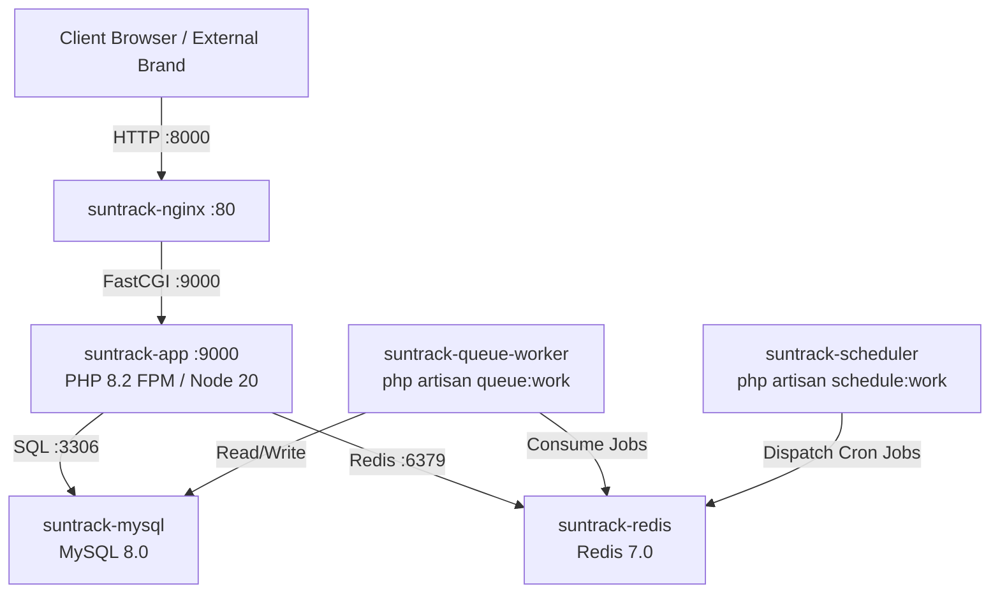

# SunTrack — Docker Architecture & Containerization Specification

SunTrack leverages Docker and Docker Compose to enforce absolute parity across local development, testing, staging, and production environments. This document outlines the container architecture, service responsibilities, network topology, and volume persistency.

---

## 1. Service Architecture

The SunTrack container stack is defined in `docker-compose.yml` and consists of 6 specialized micro-services:

### Service Details:
1. **`app` (`suntrack-app`)**:
   - **Base Image:** `php:8.2-fpm` (Debian Bullseye/Bookworm).
   - **Installed Extensions:** `pdo_mysql`, `mbstring`, `exif`, `pcntl`, `bcmath`, `gd`, `zip`, `intl`, `opcache`, `redis` (PECL).
   - **Tooling:** Composer 2.x and Node.js 20 LTS (with npm) pre-installed to support asset bundling and package management inside the container.
   - **Port:** Exposes `9000` (FastCGI) to Nginx and `5173` for Vite hot reloading.
2. **`nginx` (`suntrack-nginx`)**:
   - **Base Image:** `nginx:alpine`.
   - **Responsibility:** Acts as the HTTP reverse proxy and static asset web server. Forwards `.php` scripts to `app:9000` while natively serving `/public/build` CSS/JS assets and embedded images with security headers (`X-Frame-Options`, `X-Content-Type-Options`).
3. **`mysql` (`suntrack-mysql`)**:
   - **Base Image:** `mysql:8.0`.
   - **Responsibility:** Relational database storage for master catalogs, campaigns, promotions, secure links, RBAC rules, system settings, and activity audit trails.
   - **Healthcheck:** Automated `mysqladmin ping` every 10 seconds to ensure dependency synchronization.
4. **`redis` (`suntrack-redis`)**:
   - **Base Image:** `redis:7.0-alpine`.
   - **Responsibility:** High-speed in-memory data store acting as the primary backend for **Laravel Cache** (`system_settings`, dashboard stats), **Asynchronous Queue** (email, WhatsApp, export reports), and **User Sessions**.
5. **`queue-worker` (`suntrack-queue-worker`)**:
   - **Base Image:** Built from `Dockerfile` (identical to `app`).
   - **Command:** `php artisan queue:work redis --sleep=3 --tries=3 --max-time=3600`.
   - **Responsibility:** Continuously processes background jobs (`SendNotificationJob`, `GenerateReportExportJob`, `SyncCatalogDataJob`), isolating high-latency tasks from web request lifecycles.
6. **`scheduler` (`suntrack-scheduler`)**:
   - **Base Image:** Built from `Dockerfile` (identical to `app`).
   - **Command:** `php artisan schedule:work`.
   - **Responsibility:** Evaluates `routes/console.php` every minute, triggering recurring tasks (`suntrack:remind-approvals`, `suntrack:remind-deadlines`, `suntrack:monitor-links`, `suntrack:clean-temp-files`, `suntrack:backup-db`).

---

## 2. Persistent Storage Volumes
To prevent data loss upon container rebuilds or restarts, two named Docker volumes are provisioned:
- **`mysql_data`**: Mapped to `/var/lib/mysql` inside `suntrack-mysql`. Persists database schemas, tables, and records.
- **`redis_data`**: Mapped to `/data` inside `suntrack-redis`. Persists queued jobs, cached setting keys, and active session states across container restarts.
- **Host Bind Mount (`./:/var/www/html`)**: The root project directory is bind-mounted into `app`, `nginx`, `queue-worker`, and `scheduler`, allowing live code modifications during local development.

---

## 3. Network Topology
All services communicate over an isolated Docker bridge network named `suntrack-net`. Containers resolve each other via DNS service names (`mysql`, `redis`, `app`), shielding internal database and cache ports from unauthorized external host access.
